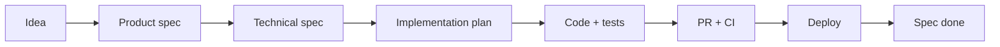

# Product to Implementation

End-to-end flow from idea to shipped code.

## Flow

## Step-by-step

| # | Actor | Action | Output |
|---|-------|--------|--------|
| 1 | Product | Draft from `docs/specs/product-spec-template.md` | Approved product spec |
| 2 | Engineering | Draft technical spec | API table, schema, security |
| 3 | Engineering | Draft implementation plan | Ordered steps, PR slices |
| 4 | Agent/Human | Branch `feature/<name>` | Git branch |
| 5 | Agent | `.ai/prompts/feature-implementation.md` per slice | Code |
| 6 | Human | PR per `docs/workflows/pull-request-workflow.md` | Merged code |
| 7 | Ops | `docs/workflows/deployment-workflow.md` | Production |
| 8 | Any | Set spec status `done` | Organisational memory |

## Decision points

| Question | If yes | If no |
|----------|--------|-------|
| User-facing? | Playwright E2E | Unit tests only |
| Schema change? | Migration in PR | Skip migrate |
| Async side effect? | Queue spec + processor | Sync API only |
| Breaking API? | Coordinate deploy / versioning | Standard deploy |

## Parallel work

- Types + API read path can merge before UI
- Mobile follows same types/API contract as web

## Anti-patterns

- Coding before technical spec approved
- Skipping `@monolith/types` when web consumes API
- Monolithic PR without plan slices

## Related

- `docs/workflows/spec-driven-development.md`
- `.ai/workflows/spec-lifecycle.md`
